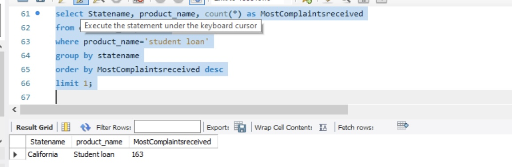

## DATA SOURCE
This data was gotten from the Complaints Dataset

## INTRODUCTION
I was  granted access to a database file called “ComplaintsDB.sql” with consumer complaints received by financial 
institutions in 2013 – 2015.

## QUESTIONS
1. Find out how many complaints were received and sent by CFPB on the same day. (Hint: 
where Date received = Date Sent)
2. Get the top 3 products that had complaints received and sent on the same day.
3. Get the top 5 issues received and sent by CFPB on the same day.
4. Get the top 5 companies targeted that the complaints were received and sent by CFPB 
on the same day.
5. Get the top 3 companies with the lowest number of complaints.
6. List the two dates CFPB had the most issues received.
7. List the two dates CFPB had the lowest number of issues received.
8. Which mode of communication had the most complaints submitted with?
9. List two states with the most complaints received by CFPB.
10. Which state had the most complaints received as regards "students’ loan" in the product 
name field?
11. List two companies having the most consumer disputed as "yes".

## ANSWERS
1. Find out how many complaints were received and sent by CFPB on the same day. (Hint: 
where Date received = Date Sent)

2. Get the top 3 products that had complaints received and sent on the same day.

3. Get the top 5 issues received and sent by CFPB on the same day.

4. Get the top 5 companies targeted that the complaints were received and sent by CFPB 
on the same day.

5. Get the top 3 companies with the lowest number of complaints.

6. List the two dates CFPB had the most issues received.

7. List the two dates CFPB had the lowest number of issues received.

8. Which mode of communication had the most complaints submitted with?

9. List two states with the most complaints received by CFPB.

10. Which state had the most complaints received as regards "students’ loan" in the product 
name field?

11. List two companies having the most consumer disputed as "yes".

## FINDINGS
1. The number of complaints sent and received on the same day totals 28,737.
2. The tops three porducts are; Mortgage, Data Collection and credit reporting. This shows were consumers had more challenges.
3. The top five issues received on the same day are; credit reports, Loan modification, collection, and foreclosure, Loan servicing, payments, and escrow account, Continued attempts to collect debt not owe and Communication tactics.
4. The tpp 5 companies that the complaints were tageted at are; Equifax, Experian, Bank of America, Wells Fargo & Company and TransUnion Intermediate Holdings, Inc. 
5. The 3 companies with the least complaint are Associated mortgage corporation, Partners for payment relief and Healthcare receivable professionals, LLC
6. On the 26th June, 2022 CFPB received 246 complaints while on the 21st february, 2022 they received 187 complaints. This shows the dates the organization received the highest complaints.
7. On 2nd september, 2022 CFPB received 1 complaints while on the 5th June, 2022 they received 1 complaints as well. This shows the dates the organization received the lowest complaints.
8. 44,904 complaints were submitted through the web. The is the highest mode of communication through which customers submit their complaints.
9. California and Florida were the two states with the most complaints. They had 9,255 and 6,306 complaints rescpectively.
10. California had the most complaints on students loans with a total of 168 complaints.
11. Bank of America and Equifax had the most number of consumer dispute showing yes. They ha 1,092 and 962 respectively.

## CONCLUSION
It was really insightful working with this data. With the results and finding, the organization will  better manage customer complaints.
